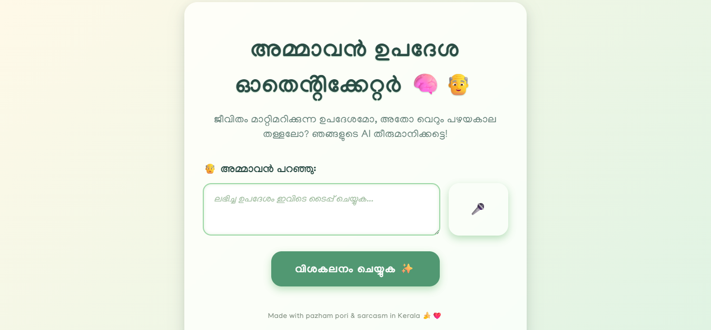
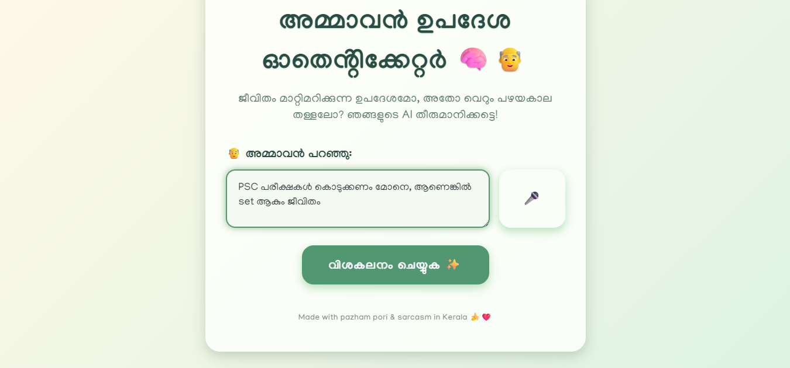
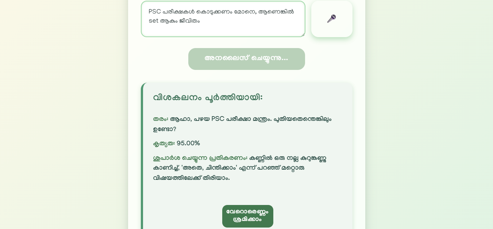
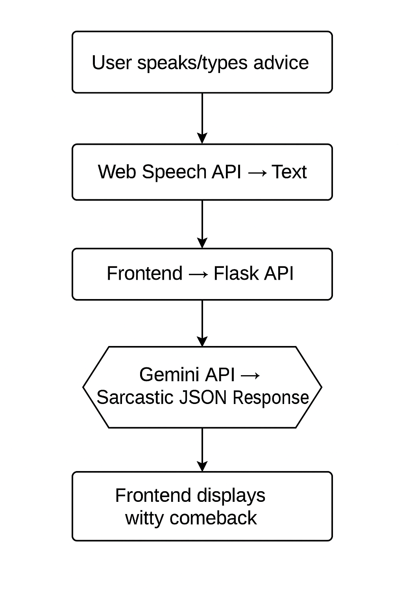
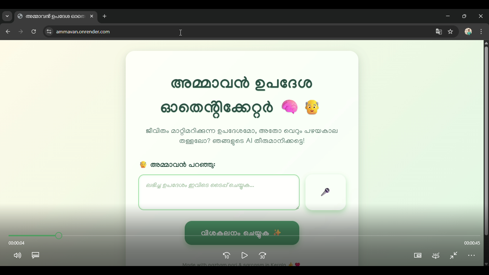

# 🧠👴 Ammavan Advice Authenticator

> *"Because unsolicited wisdom deserves AI-powered sarcasm."*

---

## 📌 Basic Details

**Team Name:** Team Epoch Fails

**Team Members:**
- **Team Lead:** Sachin K S – *COCHIN UNIVERSITY OF SCIENCE AND TECHNOLOGY*
- **Member 2:** Rohith R – *COCHIN UNIVERSITY OF SCIENCE AND TECHNOLOGY*

---

## 🎯 Project Description

The **Ammavan Advice Authenticator** is a satirical web application that uses Google's state-of-the-art **Gemini AI** to analyze unsolicited advice, typically received from Keralite uncles ("Ammavans").  

Users can type or speak the advice directly into the app, which then provides:
1. A **sarcastic classification** of the wisdom  
2. A **passive-aggressive response** to use at the next family gathering  

---

## 🤔 The Problem (that doesn’t exist)

Every year, countless hours of productive **chai-sipping** and **pazham pori-eating** are disrupted by unsolicited advice at family functions. This wisdom, while heartfelt, often feels like recycled content from the 80s.  

Until now, no modern tech solution has existed to *decode*, *classify*, and *combat* these conversations… politely.

---

## 💡 The Solution (that nobody asked for)

We built a **cloud-based, AI-powered, voice-enabled** sarcasm generator for Ammavan quotes.  
- **Voice-activated interface** using Web Speech API 🎙️  
- **Real-time AI analysis** via Google Gemini  
- **Passive-aggressive comeback suggestions** so you can escape gracefully  

---

## 🛠️ Technical Details

### **Technologies / Components**

**Languages:**  
- Python  
- HTML5, CSS3, JavaScript  

**Frameworks & APIs:**  
- Flask  
- Google Gemini API  
- Web Speech API (browser-based Speech-to-Text)  

**Libraries:**  
- `google-generativeai`  
- `python-dotenv`  
- `flask`  
- `flask-cors`  

**Tools:**  
- Visual Studio Code  
- Git & GitHub  
- Google AI Studio  

**Hardware:**  
- None (pure software magic ✨)  

---

## 🚀 Installation & Setup

### 1️⃣ Clone the repository
```bash
git clone [your-repo-link]
cd [your-repo-folder]
```
3️⃣ Install dependencies
```bash

pip install -r requirements.txt
```
OR

```bash

pip install google-generativeai python-dotenv Flask flask-cors
```
4️⃣ Configure API key
Create a .env file in the root folder:

```bash

GEMINI_API_KEY=YOUR_API_KEY_HERE
```
5️⃣ Run the backend
```bash

python app.py
```
6️⃣ Open the frontend
Open index.html in your browser.
When prompted, allow microphone access to use voice input.


## 📸 Screenshots


_The main interface of the Ammavan Advice Authenticator._


_A demonstration of the input feature._


_The AI's sarcastic analysis and recommended action after processing the advice._

 ## 🔄 Workflow Diagram


_Application workflow: The user provides advice via text or voice. The browser's Web Speech API handles the voice-to-text transcription. The frontend sends the final text to the Flask backend, which queries the Google Gemini API with a detailed, sarcastic prompt. Gemini returns a structured JSON response containing the analysis, which is then displayed back to the user on the webpage._

## 🎥 Project Demo

**Video**

[](https://youtu.be/uMU1LRy1vvY)

_Click the thumbnail above to watch a full walkthrough of the application, demonstrating both text and voice input and the AI's sarcastic, real-time analysis._

## 👨‍💻 Team Contributions

Rohith R: AI Prompt Engineering, Voice Interface Integration

Sachin: UI/UX Design, Front-End

## ⚠️ Disclaimer

This project is purely for fun.
No Ammavans were emotionally harmed in the making of this app. 😄

